## Core concepts

* [**Zarr**](https://zarr.dev/) is a chunked, compressed multi-dimensional array specification. Zarr is designed for cloud-native (network-addressable chunks in object storage) access. Zarr is the proposed specification for virtual stores at NASA.
* **Chunk manifests** are lightweight metadata structures that describe a mapping from logical data space to where that data is stored. Another term for chunk manifests is an "indirection layer". Icechunk, Kerchunk, and DMR++ are common implementations of chunk manifests.
* [**Icechunk**](https://icechunk.io/) is a transactional storage engine for Zarr arrays. Icechunk stores chunk manifests which it calls [virtual datasets](https://icechunk.io/en/stable/virtual/).
* [**Kerchunk**](https://fsspec.github.io/kerchunk/) is an early approach to creating chunk manifests (what it calls reference files) which maps virtual Zarr array coordinates to byte ranges in existing files using the JSON or Parquet file formats for persistence.
* [**DMRPP**](https://opendap.github.io/DMRpp-wiki/DMRpp.html) is a chunk manifest format from [OPeNDAP](https://opendap.github.io/DMRpp-wiki/DMRpp.html), semantically equivalent to Kerchunk or Zarr chunk manifest is mostly used internally on datasets supported by OPeNDAP. This format is however not stackable (consolidating many chunk manifests into one) like Kerchunk or Icechunk. When available it can speed up the creation of virtual stores.
* [**VirtualiZarr**](https://virtualizarr.readthedocs.io/) is a library for generating chunk manifests. Format-specific parsers are used to read chunk information and generate in-memory chunk manifests. VirtualiZarr can then write those chunk manifests to icechunk or kerchunk.
* [**GeoZarr**](https://geozarr.org/) extends Zarr with geospatial conventions, including coordinate reference systems and spatial metadata.

